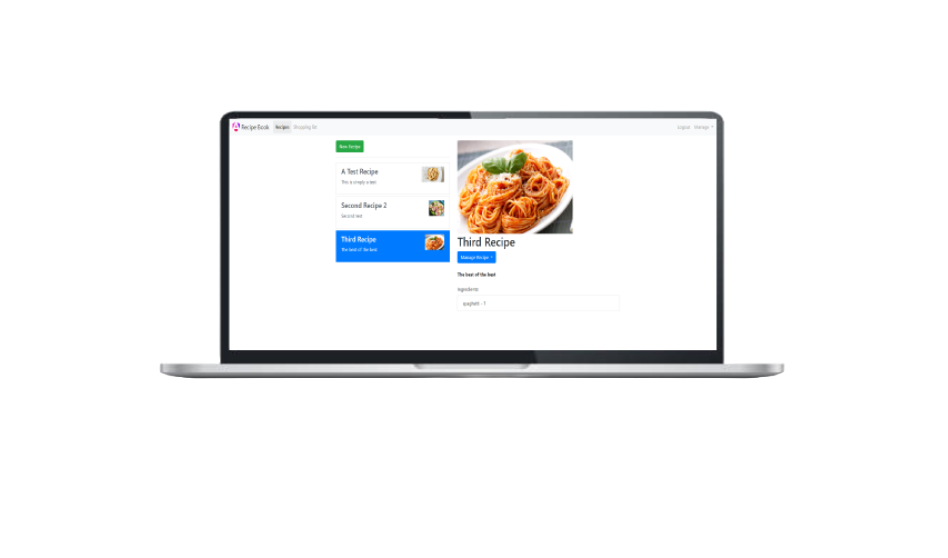

<h1 align="center">
  Recipe Book
</h1>

  

## ✨ Tecnologias

Esse projeto foi desenvolvido com as seguintes tecnologias:

- [Angular](https://angular.dev)
- [TypeScript](https://www.typescriptlang.org/)

## 💻 Projeto

O Recipe Book é um app que guarda receitas de comida. Nele é possível fazer o login de usuário e guardar/enviar as receitas para serem salvas no servidor externo.

## 🔖 Acesso

Recipe Book

## 🚀 Como executar

- Clone o repositório
- Instale as dependências com `npm install`
- Inicie o servidor com `npm start`

Agora você pode acessar [`localhost:4200`](http://localhost:4200) do seu navegador.

---
